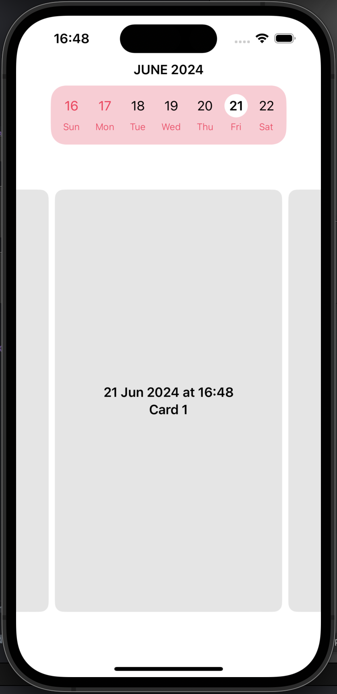

# CalendarWeek



All the calendar flow implemented for you.

💉 **Inject your views and customize everything.**

💡 **Use your own model (simply conforming to CalendarModel)**

# Actions

- To change days
  - Tap on the desired day.
  - Swipe its day content. 
- To change weeks
  - Swipe the week.             

# Usage

Create a model that conform to CalendarModel, and have a property `let day: Day`

```swift
class Card: Identifiable, CalendarModel {
    let text: String
    let day: Day // CalendarModel conformance

    init(text: String, day: Day) {
        self.text = text
        self.day = day
    }
}
```

Create an array of this model

```swift
@State var cards = [
    Card(
        text: "Card 1",
        day: Day(from: .now)
    ),
    Card(
        text: "Card 2",
        day: Day(
            from: Calendar.current.date(
                byAdding: .day,
                value: 1,
                to: .now
            )!
        )
    ),
    Card(
        text: "Card 3",
        day: Day(
            from: Calendar.current.date(
                byAdding: .day,
                value: 2,
                to: .now
            )!
        )
    )
]
```

Create the CalendarView

```swift
CalendarView(
    models: cards,
    daySpacing: 20,
    headerView: { day in
        HeaderView(selectedDay: day) // your view here
    },
    dayView: { day in
        DayComponentView(day: day) // your view here
    },
    weekBackground: {
        RoundedRectangle(cornerRadius: 20).fill(Color.pink.opacity(0.25)) // normal background here
    },
    dayContentView: {
        CardView(model: $0) // your view here
    },
    dayEmptyStateView: {
        EmptyCardView() // your view here
    }
)
```

> Note: you need to implement your own views for:       
> - Header
> - Day inside the week
> - Background of the week
> - Content of the Day
> - Empty state when there is no content for the Day
